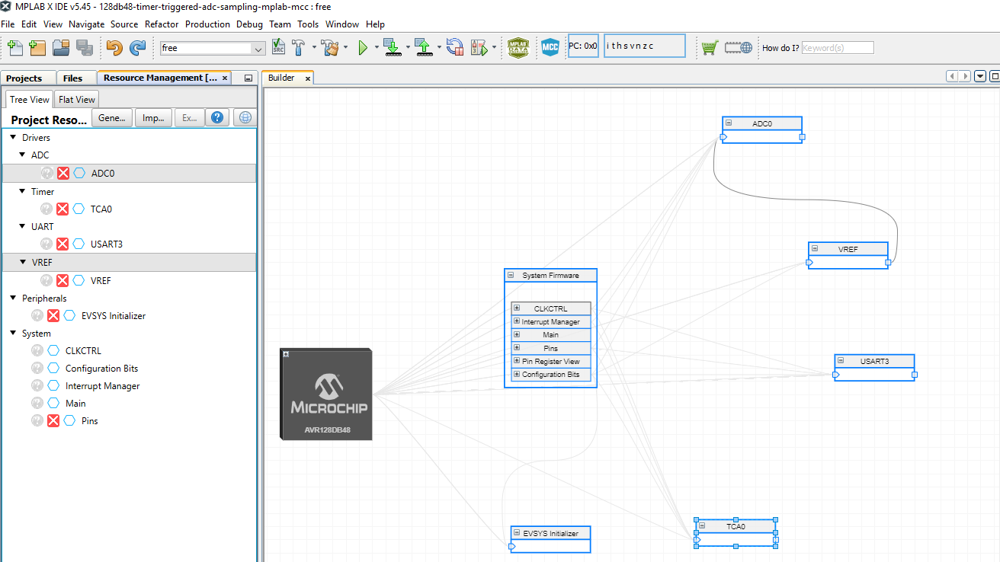
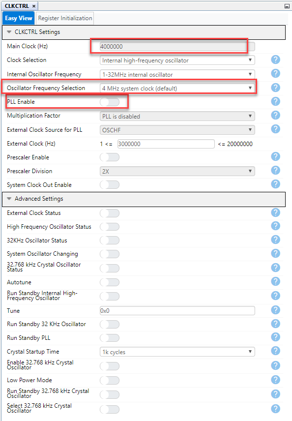
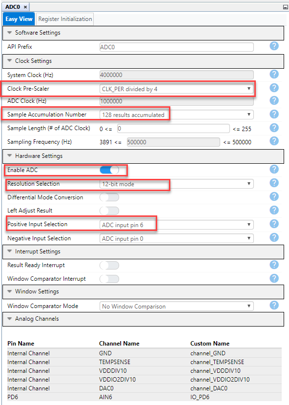
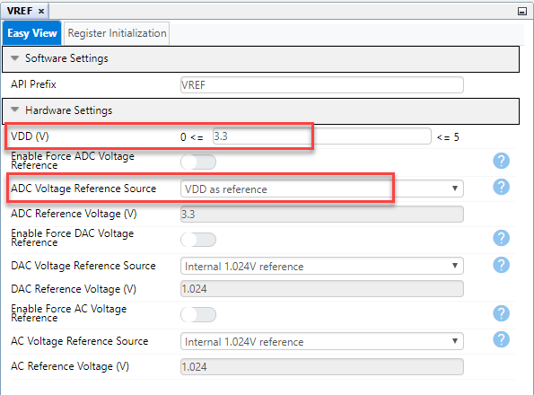
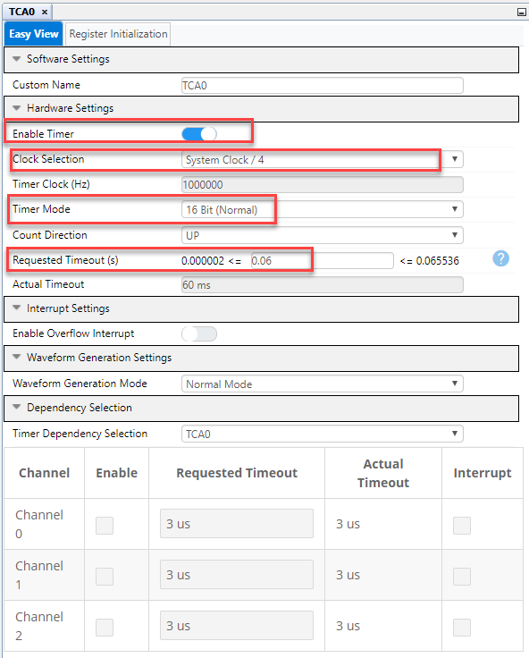
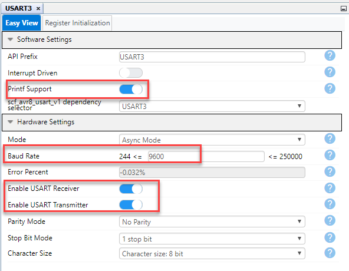
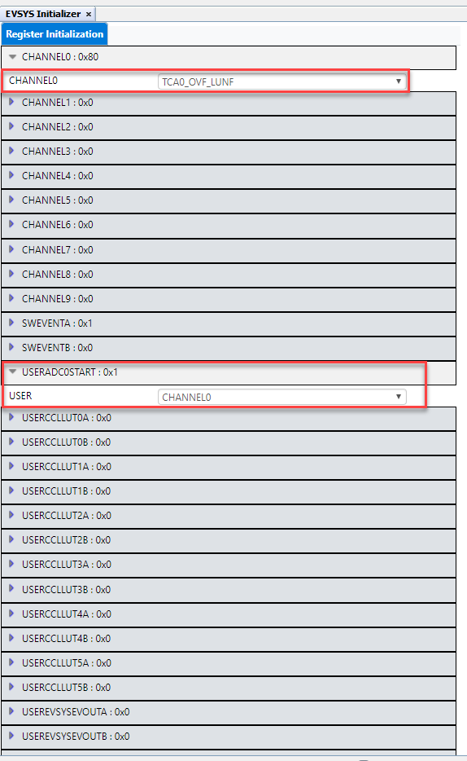
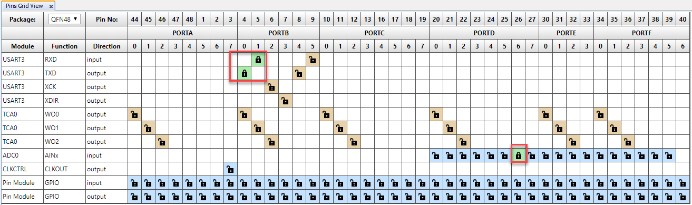
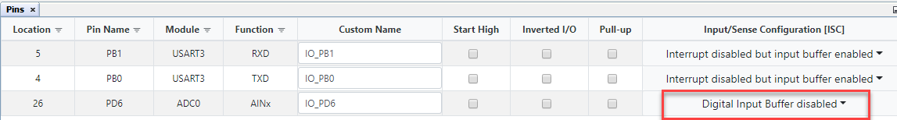
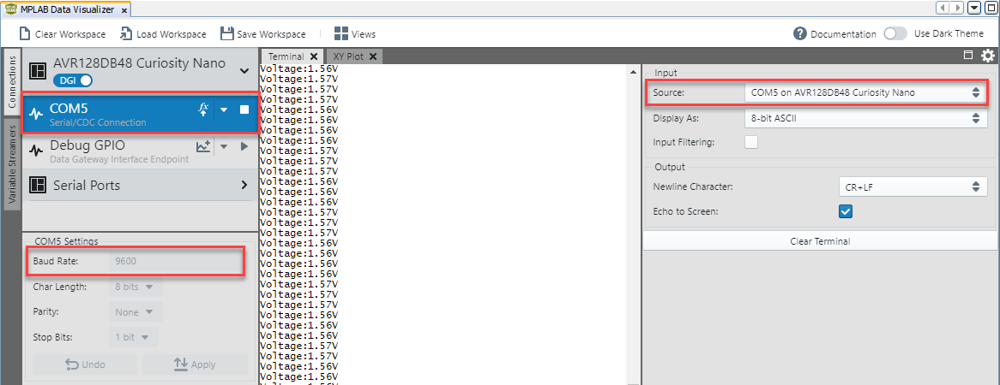

<!-- Please do not change this logo with link -->

# Timer Triggered ADC Sampling
This example shows how to configure the Analog-to-Digital Converter (ADC) on the AVR® DB Family of microcontrollers to trigger an ADC conversion on a specific event. The Timer/Counter type A (TCA) overflow is used to trigger the ADC sample accumulation. 
The ADC supports sample accumulation where configurable number of conversion results are accumulated into a single ADC result. This feature is used in the example application to accumulate 128 samples and perform averaging and measure voltage at analog pin.
Measured voltage is transmitted to serial terminal through USART.

	

## Related Documentation

- [AVR128DB48 device page](https://www.microchip.com/wwwproducts/en/AVR128DB48)
- [MPLAB Code Configurator](https://www.microchip.com/en-us/development-tools-tools-and-software/embedded-software-center/mplab-code-configurator)
- [AVR128DB48 Curiosity Nano Hardware User Guide](https://www.microchip.com/DevelopmentTools/ProductDetails/PartNO/EV35L43A)

## Software Used

- [MPLAB® X IDE v5.45](https://www.microchip.com/mplab/mplab-x-ide) or newer
- [MPLAB® Xpress IDE](https://www.microchip.com/xpress) (alternative to MPLAB X IDE)
- [XC8 Compiler v2.31](https://www.microchip.com/mplab/compilers) or newer
- [MPLAB® Code Configurator (MCC) v4.1.0](https://www.microchip.com/mplab/mplab-code-configurator) or newer
- [MPLAB® Melody Library 1.37.26 or newer](https://www.microchip.com/mplab/mplab-code-configurator) or newer
- [MCC Device Libraries 8-bit AVR MCUs 2.7.0](https://www.microchip.com/mplab/mplab-code-configurator) or newer
- [Microchip AVR128DB48 Device Support Pack AVR-Dx_DFP 1.2.88](https://packs.download.microchip.com/) or newer
-  MPLAB Data Visualizer in MPLAB X IDE or any other serial terminal application

## Hardware Used

- [AVR128DB48 Curiosity Nano](https://www.microchip.com/DevelopmentTools/ProductDetails/PartNO/EV35L43A)

## Peripherals Configuration using MCC

### Added Peripherals

### System Configuration: CLKCTRL

- CPU Clock 4 MHz
 

### ADC0 Configuration
- ADC Clock 1 MHz
- 128 samples accumulated
- 12-bit resolution
- Analog pin AIN6

### VREF Configuration

- Reference Voltage VDD
- VDD = 3.3 V

### TCA0 Configuration

- TCA clock : System Clock/4 = 1 MHz
- Timer mode: 16 bit Normal mode
- Timeout : 60ms
- Since Timeout is configured 60 ms, ADC conversion is triggered every 60 ms here

### USART3 Configuration

- Printf support enabled
- Baud rate: 9600
- TX and RX enabled

### EVENT SYSTEM Configuration

- Channel0 : TCA Timer overflow
- Event User: ADC START 
- Event system is configured so that ADC conversion starts on TCA overflow

### PINS Grid View

- USART3 TX: PB0
- USART3 RX: PB1
- ADC AIN6: PD6

### System Configuration: PINS

- Digital input buffer is disabled on Analog pin PD6 to reduce power consumption

## Setup

- Connect the AVR128DB48 Curiosity Nano board to your computer using a USB cable
- Download and install all software components as listed under 'Software Used' (note that MPLAB Xpress IDE is an online tool that cannot be downloaded)

## Operation

1. Download the zip file or clone the example to get the source code
1. Open the .X file with the MPLAB® X IDE
1. Program the AVR128DB48 Curiosity nano by clicking the *Make and Program Device Main Project* icon as shown below
	
	
	
1. Open Data Visualizer or any other serial terminal on PC.
1. Connect the Curiosity Nano Virtual COM Port and configure baud rate to 9600.
1. Connect any analog sensor at pin PD6 for example pot meter.
1. Observe voltage sent to terminal.
1. Change pot meter and observe changed voltage on terminal.

## Summary

This example shows how to configure the Analog-to-Digital Converter (ADC) to trigger a conversion on a specific event. The Timer/Counter type A (TCA)  overflow is used to trigger the ADC sample accumulation and ADC result is transmitted through USART.
